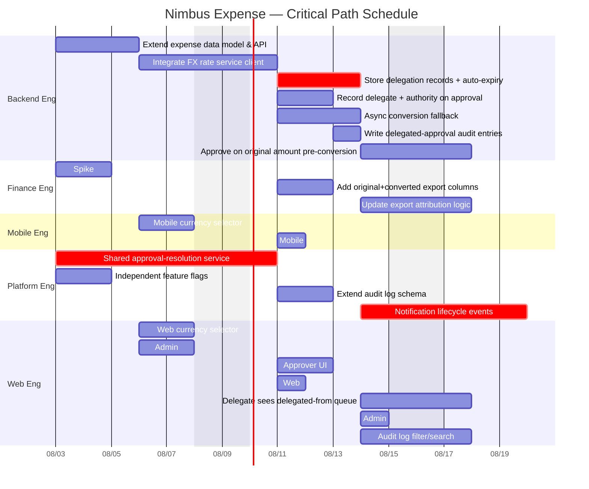

# critical-path-mapper

A [Claude Code Skill](https://docs.claude.com/en/docs/claude-code/skills) that turns a
backlog with dependencies into an actual schedule: a critical-path-method (CPM) pass,
slack per task, a Mermaid Gantt chart, and a risk register of every dependency that
crosses a team boundary.

## The problem

Backlogs get a critical-path/slack analysis maybe once, in a spreadsheet, and it goes
stale the moment a task slips or a dependency changes. Cross-team handoff risk —
usually the actual reason schedules blow up — gets tracked separately, if at all,
disconnected from the schedule math that would tell you which handoffs actually
matter.

## What it does

1. You give Claude a task list with dependencies — the `epics.json` output from
   [`prd-to-jira`](https://github.com/punit-labs/prd-to-jira-skill), a Jira export, or
   any similarly-shaped backlog.
2. Following [`skill/SKILL.md`](skill/SKILL.md), Claude normalizes it into a canonical
   `tasks.json`: one owning team per task, a velocity assumption per team
   (points/business-day), and a start date — flagging any assumption it had to
   default rather than presenting it as fact.
3. [`skill/scripts/critical_path.py`](skill/scripts/critical_path.py) — pure Python
   stdlib, no LLM involved — does the actual scheduling:
   - validates the graph (unresolved dependency ids, cycles, missing velocity data)
     and fails loudly with the exact offending task ids rather than guessing
   - runs a forward pass (earliest start/finish) and backward pass (latest
     start/finish) over a business-day calendar (weekends skipped)
   - computes slack per task and extracts the critical path chain(s) — the tasks
     with zero slack, connected in the order that actually drives the finish date
   - flags every dependency edge where the two tasks have different `team` values,
     and classifies each as on the critical path / near-critical / off-path
4. Renders `schedule.json`, `critical_path.md`, `gantt.mmd`, and `risk_register.md`.

Same split as the first project: the model normalizes and interprets, code does the
math — so the schedule is reproducible and re-running after a tasks.json edit is
instant.

## Demo

[`examples/tasks.json`](examples/tasks.json) is the scheduled version of
`prd-to-jira`'s worked example (the fictional multi-currency + delegate-approvals
PRD) — same 23 tasks, now with a team and a velocity assumption attached to each so
the CPM engine has something to compute against. Full output in
[`examples/output/`](examples/output/).

Result: **finish 2026-08-20, 13 business days from an Aug 3 start**, a 3-task
critical path running entirely through the shared approval-resolution build, and
**16 cross-team handoffs, 2 of them directly on the critical path**.

The Gantt chart, generated straight from `gantt.mmd`:

## Using it

1. Copy `skill/` into your Claude Code skills directory (project-level:
   `.claude/skills/critical-path-mapper/`, or user-level:
   `~/.claude/skills/critical-path-mapper/`).
2. In Claude Code: "map the critical path for this backlog" / "what's the schedule
   risk on these dependencies" / "build a Gantt chart for `epics.json`."
3. Claude writes `tasks.json`, then runs `critical_path.py` to produce the schedule.
4. Read `critical_path.md` first for the narrative, `risk_register.md` for the
   handoffs worth watching, `gantt.mmd` for the visual, `schedule.json` if you need
   the raw computed dates for something else.

Requires only Python 3 (stdlib only, no dependencies).

## Design notes

- **Business-day calendar, not calendar days.** Durations are business days and dates
  skip weekends on both the Python side and in the rendered Gantt chart (`excludes
  weekends`), so the two never disagree with each other.
- **Validation happens before scheduling, not during.** Unresolved dependency ids,
  cycles, and missing velocity data are all checked up front with the specific task
  ids named in the error — a malformed `tasks.json` fails fast instead of producing a
  schedule that's silently wrong.
- **A cross-team edge isn't automatically "critical."** An edge only counts as on the
  critical path if *both* tasks it connects have zero slack *and* the dependency is
  the actual binding constraint between them (not just incidentally zero on one
  side). Edges that don't clear that bar but still touch a tight task are labeled
  "near-critical" rather than lumped in with the real critical path — the distinction
  matters if you're deciding what to actually chase down first.
- **Velocity is a stated assumption, not a fact.** The skill is written to flag
  defaulted `points_per_day` values explicitly in its summary rather than quietly
  presenting a schedule as more certain than the inputs justify.

## License

MIT — see [LICENSE](LICENSE).
